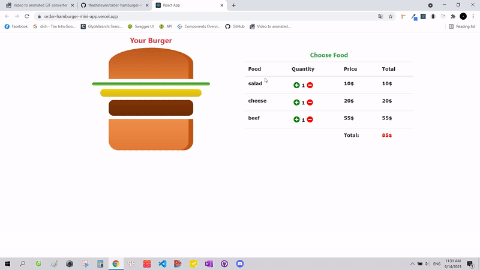

<h1>Order Burger App</h1>
<h4>Technologies: React class component, Redux, Bootstrap, CSS</h4>
<h4>Source: https://github.com/thachsteven/order-hamburger-mini-app</h4>
<h4>Live demo: https://order-hamburger-mini-app.vercel.app//</h4>

<h3>
  Order Burger is a mini order burger app that you can choose the food and the ingredients of the burger will change along with the total amount will also change
</h3>

<h2>Setting up development environment 🛠</h2>

<ul>
  <li><h4>git clone https://github.com/thachsteven/order-hamburger-mini-app.git</h4></li>
  <li><h4>cd order-hamburger-mini-app</h4></li>
  <li><h4>npm install (or yarn install)</h4></li>
  <li><h4>npm start (or yarn start)</h4></li>
</ul>

